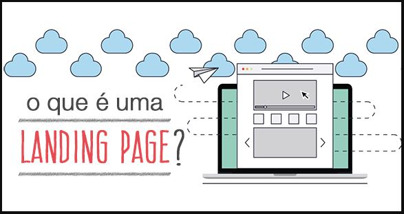

## Landing Page Rodolfo

----------

<h3>Olá, esse projeto contempla uma atividade de avaliação!
 
Ela consiste na criação de uma Landing Page contendo informações gerais
 
Uma atividade contendo conceitos básicos de Front-End 
 
</h3>

----------

 
<h3><i>De acordo com o Portal Sebrae:</i></h3>

 <blockquote>"Uma landing page tem como principal objetivo a conversão de leads, ou seja,  
 fazer com que o visitante se torne um cliente, passando para a próxima etapa do funil de vendas.
 Elas também são conhecidas como páginas de aterrissagem, páginas de conversão, de captura ou de destino."
</blockquote>

## Tecnologias Usadas

* HTML
* CSS 
* Framework (Bootstrap)

